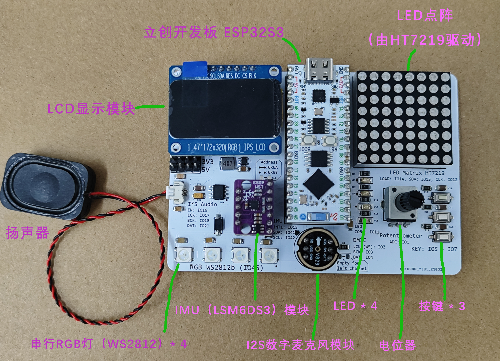
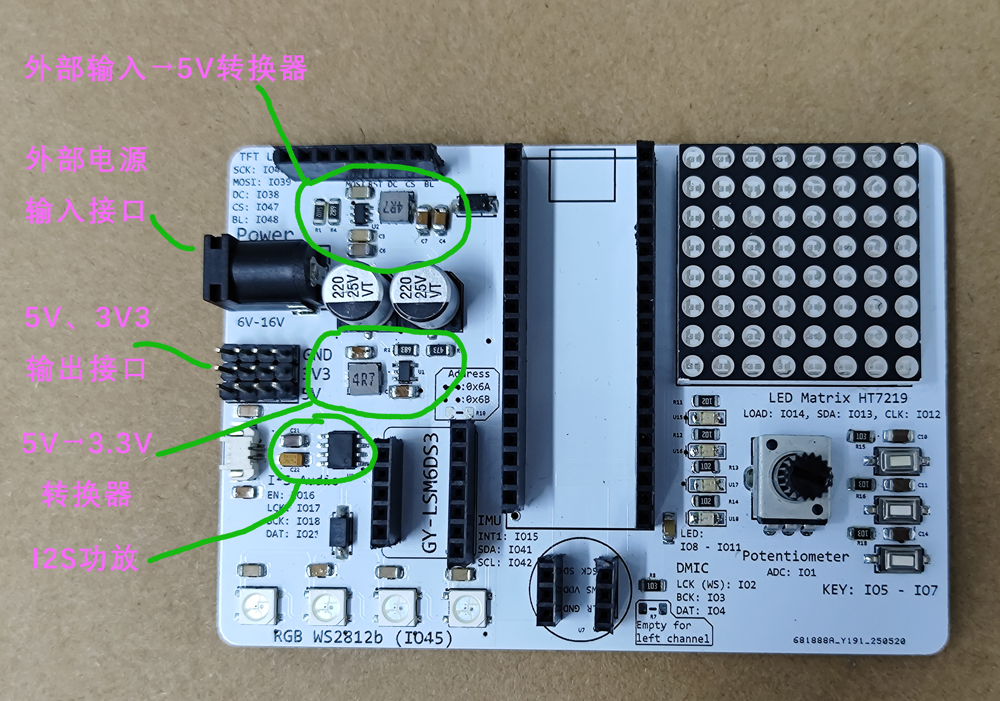

# ESP32-Elite Demo

[中文版](README_zh.md)

Some demo projects for ESP32-Elite Board

ESP32-Elite is a development board based on LCKFB ESP32S3 core
for beginners and to explore the capabilities of the ESP32 platform.  

The following is a picture of the board with modules installed:

and a picture of the board with modules removed:

The demos are designed to be used with the PlatformIO extension in VSCode,
allowing users to easily upload code to the board and interact with it.

## Getting Started

0. Install the PlatformIO extension in VSCode
1. Open one of the demo projects in VSCode
2. Upload the code to your ESP32-Elite board
3. See what happens!

## Available Demos

- **Demo 0**: Hello World
  - A simple demo that blinks the onboard LED,
    prints a counter value to the Serial Monitor
    and echoes messages received from the Serial Monitor.

- **Demo 1**: Buttons and LEDs
  - Demonstrates how to use buttons, control LEDs on the ESP32-Elite board
  and print messages to the Serial Monitor when buttons are pressed.

- **Demo 2**: ADC
  - Demonstrates how to read analog values from the potentiometer,
  display them on the Serial Monitor
  and create a task to control the LED blinking rate
  based on the potentiometer position.

- **Demo 3**: RGB
  - Demonstrates how to control an WS2812 RGB LED using
  the `Adafruit_NeoPixel` library and change its color
  based on button presses detected by interrupts.

- **Demo 4**: IMU
  - Demonstrates how to use the onboard IMU (Inertial Measurement Unit)
  LSM6DS3 to read acceleration and gyroscope data,
  and print the values to the Serial Monitor or visualize the attitude
  using the `Teleplot` extension in VSCode.

- **Demo 5**: Audio
  - Demonstrates how to play audio files from the SPIFFS
  filesystem using the `Audio` library and control playback
  using buttons on the ESP32-Elite board.

- **Demo 6**: Matrix
  - Demonstrates how to control a 8x8 LED matrix using the `U8G2` library,
  displaying a scrolling text message.

- **Demo 7**: MIC
  - Demonstrates how to use the onboard digital microphone
  to capture audio data to control the count of LEDs
  based on the sound level detected by the microphone
  and print the sound level to the Serial Monitor which
  can be visualized using the `Teleplot` extension in VSCode.

- **Demo 8**: LCD Simple
  - Demonstrates how to use the onboard LCD display
  to show simple text messages and control the display
  using buttons on the ESP32-Elite board.

- **Demo 9**: LVGL-LED-ADC
  - Demonstrates how to use the LVGL library to create a simple GUI
  that displays the current value of the potentiometer
  and allows control of LEDs using checkboxes with input from the buttons.

- **Demo 10**: LVGL-Spectrogram
  - Demonstrates how to create a simple audio spectrum analyzer
  using the LVGL library, displaying the audio levels captured
  from the onboard microphone in a graphical format.
